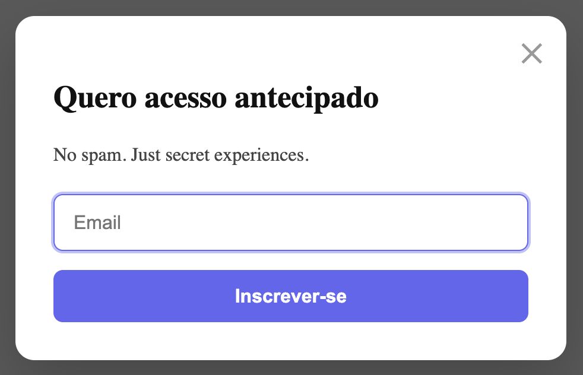

# 🔮 PulseModal

A modern, accessible, and animated modal component focused on real-world UX.  
Built with React, TypeScript, Framer Motion, and WCAG-compliant accessibility practices.

---


---

## 📸 Preview



---

## ✨ Features

- Auto-focus on the first input
- Keyboard focus trap inside the modal
- Dismiss via `ESC` key or backdrop click
- Full ARIA support: `aria-modal`, `aria-labelledby`, `aria-describedby`
- Responsive layout and touch-friendly interactions
- Smooth open/close animations with Framer Motion
- Close button positioned top-right with visible focus style

---

## 🚀 Tech Stack

- React 18
- TypeScript
- Framer Motion
- CSS Modules
- Vite

---

## ▶️ Getting Started

```bash
git clone https://github.com/sallesbruna/accessibility-react.git
cd accessibility-react
npm install
npm run dev

---

🧠 Accessibility Highlights
WCAG 2.1 AA compliant structure

Proper semantic roles (dialog)

Focus visibility and keyboard navigation

Min 44px height on interactive elements (touch targets)

Screen reader label support via .srOnly

✍️ Author
Created by Bruna Salles
UX Designer & Creative Developer focused on meaningful experiences, accessibility, and elegance.

📄 License
MIT — free to use, modify, and distribute with credit.

---


